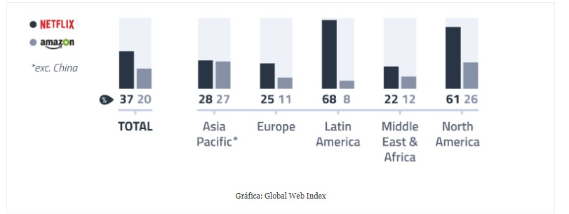
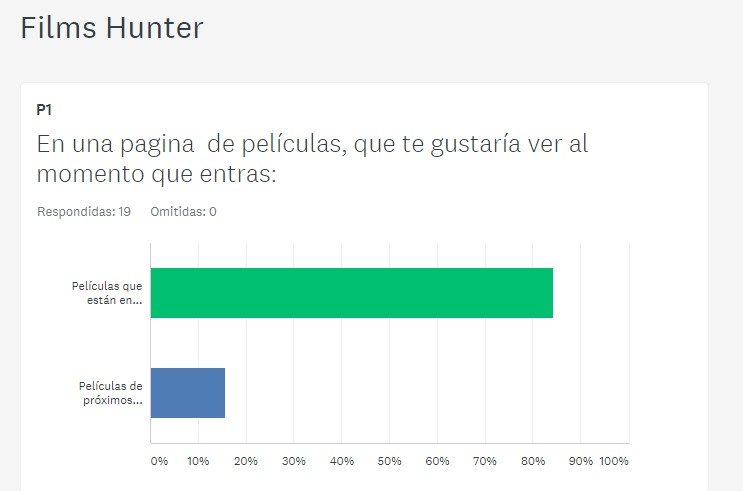
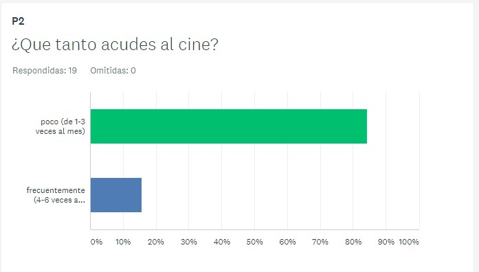
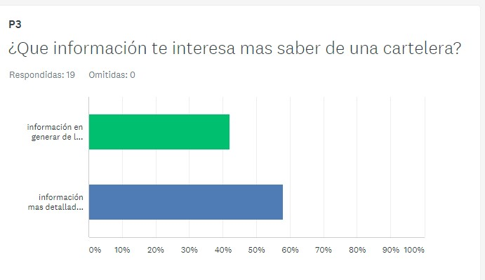
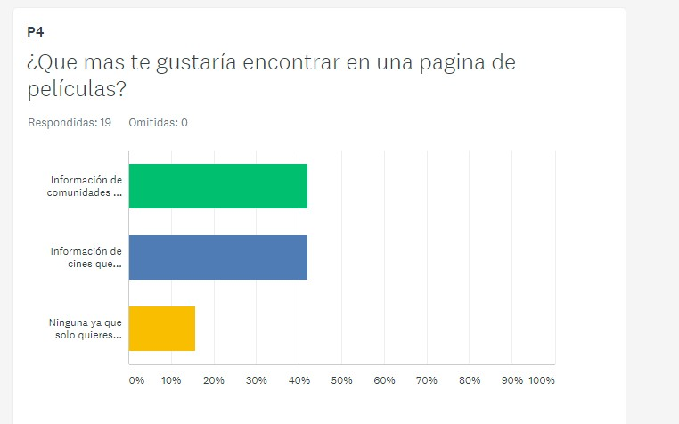

## F I L M S - H U NT E R

  

## Objetivo

   Aplicación móvil para cinéfilos y cazadores de películas.

 *  buscar películas
 *  leer la reseña
 *  mostrar los próximos estrenos

## Análisis del usuario

 VISIÓN DEL MERCADO GLOBAL

 Netflix domina el mercado mexicano: 72% de los usuarios de internet en México posee una cuenta de Netflix, esto significa que nuestro país es el mercado con más participación donde opera la compañía de transmisión de video por internet.

 Brasil se encuentra en segundo lugar, donde Netflix posee 67% del mercado; en Argentina controla 63%. En cuarto lugar aparece Estados Unidos, qye posee 62% y Canadá, 56%, de acuerdo con un análisis hecho por la firma de investigación Global Web Index.

 Nuestro país tiene 65.5 millones de internautas, una penetración de 63% de la población mexicana de 6 años en adelante, de acuerdo con el Instituto Nacional de Estadística y Geografía (Inegi) hasta 2016.

 Estos datos aparecen después de que en junio, Amazon extendiera su servicio de streaming, Prime Video, a todos los mercados del mundo por 2.99 dólares por los primeros seis meses.

 “Por mercado, Netflix tiene un firme posicionamiento en el contienente americano”, agregó la firma.

 La proporción de mercado en cada región del mundo solo está empatada en Asía-Pacífico. En América Latina la proporción es de 68% versus 8% para la compañía de Jeff Bezos. En América del Norte la sombra de Netflix sobre sus competidores es de 61%.

 

 Films hunter es un app que mantiene al público informado respecto los próximos estrenos, las películas que se encuentran en cartelera y recomendaciones de la comunidad que gusta del cine.

 Revisando las estádísticas y realizando encuestas nos dimos cuenta de la necesidad del público por estar al tanto de los próximos estrenos, ya que es común ver algún corto e interesarse por la película, pero despúes no asistir a verla porque no se enteraron cuando se estrenó e incluso olvidaron el nombre de la película.

 Se volvió a encuestar al público en base a lo que nos habían solicitado y eso nos permitió desarrollar el diseño del PMV.
 Estos fueron los resultados de la segunda encuesta:

 

 

 

 

 Usando el método de scrum, partimos de un to do list, se repartieron las tareas y comenzamos el trabajo, revisando que se ha logrado y que está pendiente.

 Ya ingresamos a la data y tenemos el poster, el nombre de la película y un plot.

 Para el viernes esperamos usar la API de YOUTUBE para mostrar el tráiler de la película y la API de google places para mostrar los cines cercanos.

 Decidimos utilizar Materialize pues nos permite hacer una web-app y tener la vista Desktop y mobile.

 La API que estamos usando es THE MOVIE DB (TMDb).
